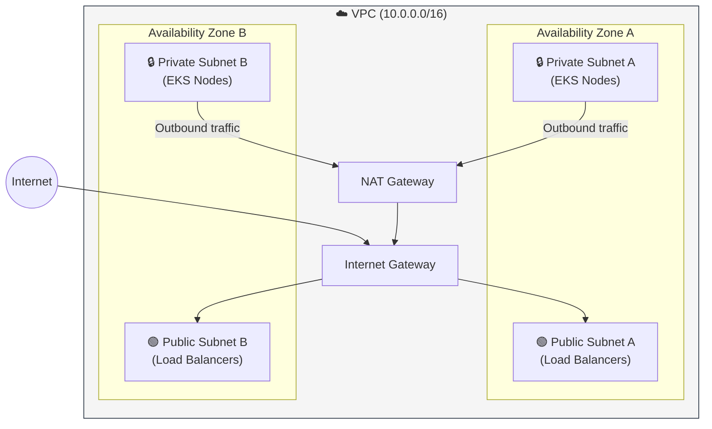

# 🏗️ Architecture Design Document (ADD)

Este documento describe la arquitectura técnica, la topología de red y las decisiones de diseño fundamentales del laboratorio **AWS EKS Enterprise GitOps**.

---

## 1. Topología de Red (Network Topology)

La infraestructura se despliega en una VPC personalizada diseñada para alta disponibilidad y seguridad en capas.

### Diseño de Subnets
| Capa | Tipo | Acceso | Propósito |
| :--- | :--- | :--- | :--- |
| **Public Layer** | Public Subnets (x2) | IGW (Internet Gateway) | Balanceadores de Carga (ALB/NLB) y NAT Gateways. |
| **Private Layer** | Private Subnets (x2) | NAT Gateway (Salida) | Nodos de EKS (Worker Nodes). Sin acceso directo desde internet. |
| **Data Layer** | Private Subnets (x2) | Aislado | (Opcional) Bases de datos RDS/DynamoDB. |

---

## 2. Decisiones de Arquitectura (ADRs)

### ADR-001: Terragrunt como Orquestador de IaC
* **Contexto:** Terraform puro conlleva mucha duplicación de código en la configuración del backend y proveedores.
* **Decisión:** Usar **Terragrunt**.
* **Consecuencia:** Código DRY (Don't Repeat Yourself), dependencias explícitas entre VPC y EKS, y gestión atómica del estado.

### ADR-002: Modelo de GitOps "Pull-Based" con ArgoCD
* **Contexto:** Los pipelines tradicionales CI/CD (Jenkins/GitLab CI) requieren credenciales de admin del clúster ("Push-based"), lo cual es un riesgo de seguridad.
* **Decisión:** Usar **ArgoCD** (Pull-based).
* **Consecuencia:** El clúster no expone sus credenciales hacia afuera. ArgoCD vive dentro y "jala" los cambios. Self-healing automático si hay drift.

### ADR-003: Ingress y Service Exposure
* **Contexto:** Necesitamos exponer la aplicación `colors-app` y la UI de ArgoCD.
* **Decisión:** Usar **Service type LoadBalancer** (NLB/ALB clásico) para simplificar el laboratorio.
* **Nota:** En un entorno productivo real, se usaría un *AWS Load Balancer Controller* con un solo ALB para múltiples servicios (Ingress).

---

## 3. Modelo de Seguridad

1.  **IAM Roles for Service Accounts (IRSA):** Los Pods no usan las credenciales de los nodos EC2. Asumimos roles IAM específicos vinculados a cuentas de servicio de Kubernetes (OIDC).
2.  **Principio de Menor Privilegio:** Los Security Groups de los nodos solo permiten tráfico desde el Control Plane y entre ellos mismos.
3.  **Cifrado:** Secretos de Kubernetes cifrados en reposo (etcd) mediante AWS KMS.

---

## 4. Estrategia de Escalabilidad

* **Horizontal Pod Autoscaler (HPA):** Escala la cantidad de Pods basándose en CPU/Memoria.
* **Cluster Autoscaler:** (Configurable) Aumenta la cantidad de nodos EC2 si los Pods se quedan en estado "Pending" por falta de recursos.
