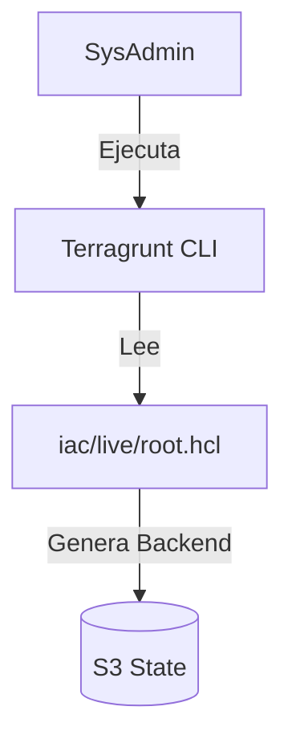
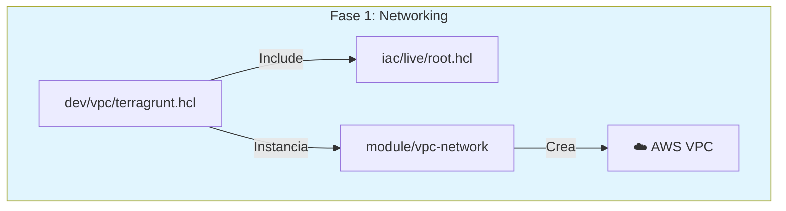
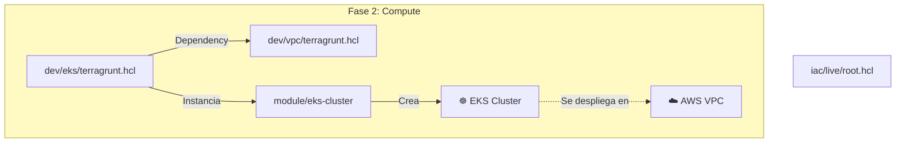

# 📂 Anatomía del Proyecto: Documentación Técnica de Archivos

Este documento desglosa cada archivo de configuración utilizado en el laboratorio **AWS EKS Enterprise GitOps**. Explica su función, ciclo de vida e interacción dentro de la arquitectura.

---

## 🏗️ Nivel 0: Los Cimientos (Root Configuration)

Antes de crear cualquier recurso, necesitamos definir **dónde** se guardará el estado y **quién** proveerá los recursos.

### 1. `iac/live/root.hcl` (El Padre)
* **Qué hace:** Es el archivo de configuración global. Define el bloque `remote_state` (S3 + DynamoDB) y genera el bloque `provider "aws"` dinámicamente usando el ID de la cuenta AWS.
* **Contenido Clave:** Configuración dinámica del Bucket `eks-gitops-platform-tfstate-<ACCOUNT_ID>` y la tabla de bloqueo DynamoDB.
* **Cuándo se usa:** Cada vez que ejecutas `terragrunt` en cualquier subcarpeta. Los hijos "heredan" esta configuración.
* **Quién lo lee:** El binario de **Terragrunt** (antes de llamar a Terraform).
* **Objetivo:** Principio DRY (Don't Repeat Yourself). Evitar copiar/pegar la configuración del backend en 10 sitios distintos.

---

## 🌐 Nivel 1: La Red (Networking Layer)

Aquí definimos la carretera por donde viajarán nuestros datos.

### 2. `iac/live/dev/vpc/terragrunt.hcl` (El Instanciador)
* **Qué hace:** Invoca al módulo genérico de VPC y le pasa los valores específicos para este entorno (CIDR `10.0.0.0/16`, Nombres, Tags).
* **Quién lo lee:** Terragrunt.
* **Objetivo:** Definir que *esta* ejecución específica es para el entorno "Dev" en "us-east-1".

### 3. `iac/modules/vpc-network/main.tf` (El Plano)
* **Qué hace:** Contiene el código Terraform puro. Define recursos `aws_vpc`, `aws_subnet`, `aws_nat_gateway`.
* **Cuándo se usa:** Durante `terragrunt apply`.
* **Objetivo:** Abstraer la complejidad de crear una red de 3 capas (Pública/Privada/Database).

### 4. `iac/modules/vpc-network/versions.tf` (El Protector)
* **Qué hace:** Bloquea la versión del proveedor AWS (`< 6.0`).
* **Objetivo:** Evitar el "Dependency Hell". Asegura que el código no se rompa si AWS lanza una actualización incompatible mañana.

---

## ⚙️ Nivel 2: Cómputo (Compute Layer)

Ahora colocamos el motor (Kubernetes) sobre la carretera (VPC).

### 5. `iac/live/dev/eks/terragrunt.hcl` (El Coordinador)
* **Qué hace:** Define las dependencias explícitas (`dependency "vpc"`). Le dice a Terragrunt: "No crees el EKS hasta que la VPC tenga un ID válido".
* **Contenido Clave:** Bloque `inputs` que lee `dependency.vpc.outputs.vpc_id`.
* **Objetivo:** Orquestación. Manejar el orden de despliegue automáticamente.

### 6. `iac/modules/eks-cluster/main.tf` (El Motor)
* **Qué hace:** Define el Control Plane de EKS y los Node Groups (instancias EC2).
* **Quién lo lee:** Terraform AWS Provider.
* **Objetivo:** Provisionar un clúster Kubernetes listo para producción con roles IAM (IRSA) integrados.

---

## 🐙 Nivel 3: Plataforma (GitOps Engine)

Instalamos el "cerebro" que gestionará las aplicaciones.

### 7. `iac/live/dev/platform/terragrunt.hcl` (El Puente Helm)
* **Qué hace:** Genera la configuración para conectarse al clúster EKS recién creado. Obtiene las credenciales del clúster dinámicamente.
* **Objetivo:** Permitir que Terraform hable con Kubernetes sin configurar `~/.kube/config` manualmente.

### 8. `iac/modules/argo-platform/main.tf` (El Instalador)
* **Qué hace:** Usa el `helm_release` resource para bajar el Chart oficial de ArgoCD e instalarlo.
* **Cuándo se usa:** Fase de bootstrapping de aplicaciones.
* **Objetivo:** Dejar el clúster listo con ArgoCD y Argo Rollouts funcionando.

---

## 🛡️ Nivel 5: FinOps & Seguridad (Scripts)

Automatización Bash para garantizar consistencia y limpieza FinOps.

### 9. `scripts/setup_backend.sh` (El Constructor)
* **Función:** Crea los recursos base (S3 + DynamoDB) para el estado de Terraform.
* **Seguridad:** Aplica cifrado AES256, bloquea acceso público y activa versionado.
* **Lógica:** Genera nombres dinámicos basados en el ID de cuenta AWS (`eks-gitops-platform-tfstate-<ACCOUNT_ID>`) para evitar conflictos de nombres globales.

### 10. `scripts/check_backend.sh` (El Monitor)
* **Función:** Verifica si el backend existe y es accesible.
* **Uso:** Ejecutar antes de empezar para validar prerrequisitos y después de terminar para validar limpieza.

### 11. `scripts/nuke_backend_smart.sh` (El Destructor Inteligente)
* **Función:** Elimina el backend creado por `setup_backend.sh`.
* **Seguridad:** Requiere confirmación manual ("NUKE").
* **Capacidades:** Vacia versiones de objetos S3 (necesario para buckets con versionado) antes de borrar el bucket. Detecta dinámicamente el nombre correcto del recurso.

### 12. `scripts/finops_audit.sh` (El Auditor)
* **Función:** Escanea la cuenta de AWS en busca de recursos costosos huérfanos (Load Balancers, EIPs, Volúmenes EBS, NAT Gateways).
* **Objetivo:** Garantizar costo cero al finalizar el laboratorio.

### 13. `scripts/nuke_vpc.sh` (El Exterminador)
* **Función:** Rompe dependencias cíclicas. Busca ENIs y Security Groups huérfanos y los fuerza a borrarse cuando Terraform falla al borrar la VPC.

---

**Autor:** Jose Garagorry
**Proyecto:** AWS EKS Enterprise GitOps
