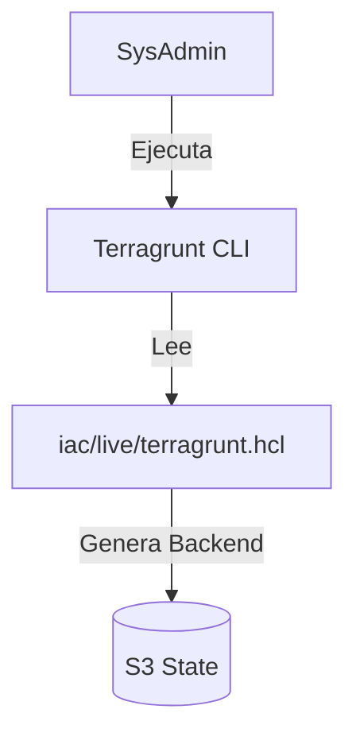
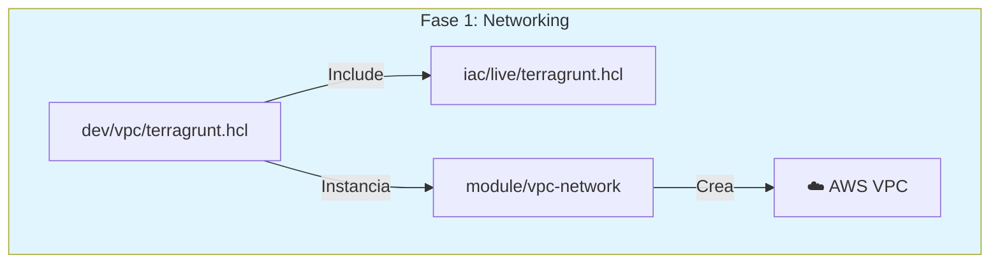
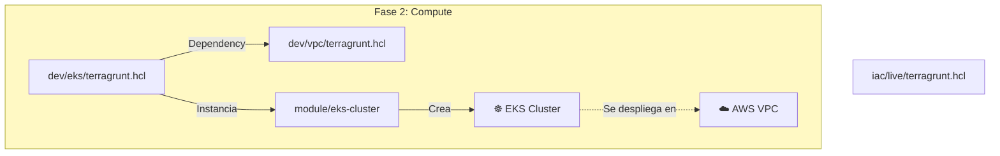
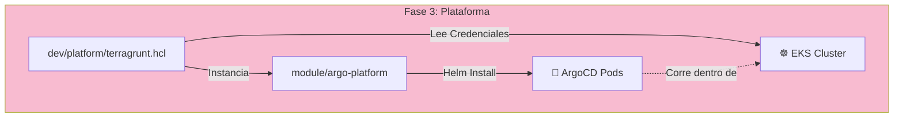
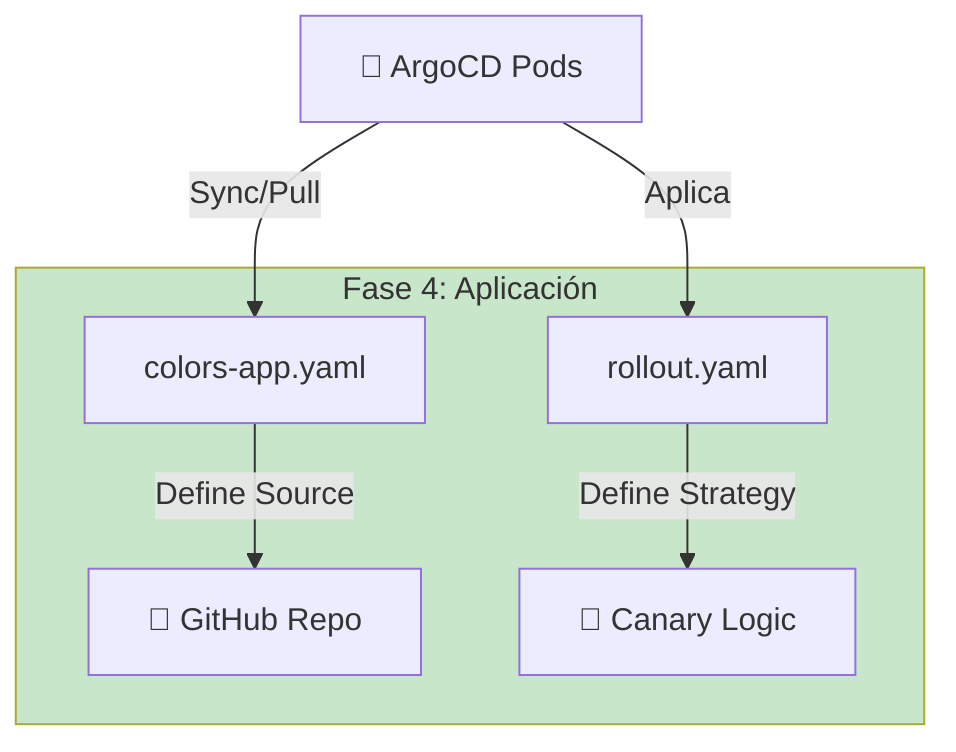
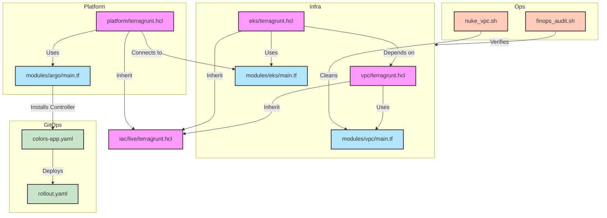

# 📂 Anatomía del Proyecto: Documentación Técnica de Archivos

Este documento desglosa cada archivo de configuración utilizado en el laboratorio **AWS EKS Enterprise GitOps**. Explica su función, ciclo de vida e interacción dentro de la arquitectura.

---

## 🏗️ Nivel 0: Los Cimientos (Root Configuration)

Antes de crear cualquier recurso, necesitamos definir **dónde** se guardará el estado y **quién** proveerá los recursos.

### 1. `iac/live/terragrunt.hcl` (El Padre)
* **Qué hace:** Es el archivo de configuración global. Define el bloque `remote_state` (S3 + DynamoDB) y genera el bloque `provider "aws"` dinámicamente.
* **Contenido Clave:** Configuración del Bucket S3 `aws-eks-enterprise-gitops-state` y la tabla de bloqueo DynamoDB.
* **Cuándo se usa:** Cada vez que ejecutas `terragrunt` en cualquier subcarpeta. Los hijos "heredan" esta configuración.
* **Quién lo lee:** El binario de **Terragrunt** (antes de llamar a Terraform).
* **Objetivo:** Principio DRY (Don't Repeat Yourself). Evitar copiar/pegar la configuración del backend en 10 sitios distintos.

---

## 🌐 Nivel 1: La Red (Networking Layer)

Aquí definimos la carretera por donde viajarán nuestros datos.

### 2. `iac/live/dev/vpc/terragrunt.hcl` (El Instanciador)
* **Qué hace:** Invoca al módulo genérico de VPC y le pasa los valores específicos para este entorno (CIDR `10.0.0.0/16`, Nombres, Tags).
* **Quién lo lee:** Terragrunt.
* **Objetivo:** Definir que *esta* ejecución específica es para el entorno "Dev" en "us-east-1".

### 3. `iac/modules/vpc-network/main.tf` (El Plano)
* **Qué hace:** Contiene el código Terraform puro. Define recursos `aws_vpc`, `aws_subnet`, `aws_nat_gateway`.
* **Cuándo se usa:** Durante `terragrunt apply`.
* **Objetivo:** Abstraer la complejidad de crear una red de 3 capas (Pública/Privada/Database).

### 4. `iac/modules/vpc-network/versions.tf` (El Protector)
* **Qué hace:** Bloquea la versión del proveedor AWS (`< 6.0`).
* **Objetivo:** Evitar el "Dependency Hell". Asegura que el código no se rompa si AWS lanza una actualización incompatible mañana.

---

## ⚙️ Nivel 2: Cómputo (Compute Layer)

Ahora colocamos el motor (Kubernetes) sobre la carretera (VPC).

### 5. `iac/live/dev/eks/terragrunt.hcl` (El Coordinador)
* **Qué hace:** Define las dependencias explícitas (`dependency "vpc"`). Le dice a Terragrunt: "No crees el EKS hasta que la VPC tenga un ID válido".
* **Contenido Clave:** Bloque `inputs` que lee `dependency.vpc.outputs.vpc_id`.
* **Objetivo:** Orquestación. Manejar el orden de despliegue automáticamente.

### 6. `iac/modules/eks-cluster/main.tf` (El Motor)
* **Qué hace:** Define el Control Plane de EKS y los Node Groups (instancias EC2).
* **Quién lo lee:** Terraform AWS Provider.
* **Objetivo:** Provisionar un clúster Kubernetes listo para producción con roles IAM (IRSA) integrados.

---

## 🐙 Nivel 3: Plataforma (GitOps Engine)

Instalamos el "cerebro" que gestionará las aplicaciones.

### 7. `iac/live/dev/platform/terragrunt.hcl` (El Puente Helm)
* **Qué hace:** Genera la configuración para conectarse al clúster EKS recién creado. Obtiene las credenciales del clúster dinámicamente.
* **Objetivo:** Permitir que Terraform hable con Kubernetes sin configurar `~/.kube/config` manualmente.

### 8. `iac/modules/argo-platform/main.tf` (El Instalador)
* **Qué hace:** Usa el `helm_release` resource para bajar el Chart oficial de ArgoCD e instalarlo.
* **Cuándo se usa:** Fase de bootstrapping de aplicaciones.
* **Objetivo:** Dejar el clúster listo con ArgoCD y Argo Rollouts funcionando.

---

## 🚀 Nivel 4: Aplicación (GitOps & Rollouts)

Archivos que viven en Git y definen *qué* debe correr, no *dónde*.

### 9. `gitops-manifests/apps/colors-app.yaml` (El Contrato)
* **Qué hace:** Es un CRD (Custom Resource Definition) de tipo `Application`. Le dice a ArgoCD: "Vigila la carpeta `app-source/helm-chart` en este repo".
* **Quién lo lee:** El controlador de ArgoCD dentro del clúster.
* **Objetivo:** Automatización pura. Conectar Git con K8s.

### 10. `app-source/helm-chart/templates/rollout.yaml` (La Estrategia)
* **Qué hace:** Sustituye al `Deployment` tradicional. Define la lógica Canary (`steps`, `setWeight`, `pause`).
* **Quién lo lee:** El controlador de Argo Rollouts.
* **Objetivo:** Progressive Delivery. Permitir actualizaciones seguras (Blue/Green/Canary).

---

## 🛡️ Nivel 5: FinOps & Seguridad (Scripts)

Herramientas de mantenimiento y limpieza.

### 11. `scripts/finops_audit.sh` (El Auditor)
* **Qué hace:** Usa AWS CLI para listar recursos costosos (LB, NAT, EIP) filtrando por Tag de proyecto.
* **Cuándo se usa:** Después de `destroy` para asegurar costo cero.
* **Objetivo:** Evitar facturas sorpresa.

### 12. `scripts/nuke_vpc.sh` (El Exterminador)
* **Qué hace:** Rompe dependencias cíclicas. Busca ENIs y Security Groups huérfanos y los fuerza a borrarse.
* **Cuándo se usa:** Cuando Terraform falla al borrar la VPC por error `DependencyViolation`.
* **Objetivo:** Limpieza nuclear cuando la vía diplomática (Terraform) falla.

---

## 🗺️ Diagrama de Flujo Completo

Así interactúan todos los archivos desde el inicio hasta el fin:

---
**Autor:** Jose Garagorry
**Proyecto:** AWS EKS Enterprise GitOps
