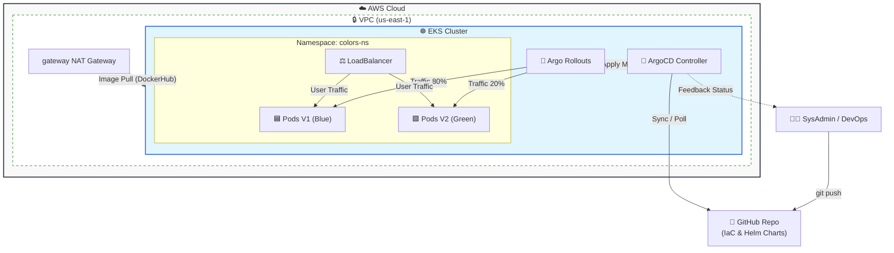

# AWS EKS Enterprise GitOps Platform

> **Una plataforma de Infraestructura como Código (IaC) y Entrega Continua (CD) diseñada para la resiliencia, la escalabilidad y el control de costos.**

---

## 🎯 La Estrategia: Del "Dolor" a la Solución

En el mundo real de TI, los equipos sufren problemas recurrentes que este laboratorio resuelve directamente:

| El Dolor (Problema) 😫 | La Solución de este Laboratorio 💊 |
| :--- | :--- |
| **"Dependency Hell":** Actualizaciones de proveedores (AWS v6.0) rompen el código y tiran producción. | **Version Pinning & Constraints:** Gestión estricta de versiones en Terraform (`< 6.0`) para garantizar estabilidad a largo plazo. |
| **Despliegues "Big Bang":** Lanzar una nueva versión y rezar para que no rompa nada. | **Canary Deployments:** Uso de Argo Rollouts para liberar tráfico progresivamente (20% -> 50% -> 100%) validando salud en cada paso. |
| **Configuración a la deriva (Drift):** Alguien cambia algo manualmente en la consola y nadie sabe qué fue. | **GitOps con ArgoCD:** Git es la única fuente de verdad. Si se cambia algo manualmente, ArgoCD lo detecta y lo corrige (Self-Healing). |
| **Facturas Sorpresa (Bill Shock):** Recursos zombis (NAT Gateways, ENIs) que quedan activos tras borrar el clúster. | **FinOps & Auditoría:** Scripts personalizados de auditoría y destrucción (`nuke`) que garantizan limpieza total y costo cero al terminar. |

---

## 🏛️ ¿Por qué es este un Laboratorio "Nivel Enterprise"?

Este no es un tutorial de "Hello World". Este laboratorio simula un entorno corporativo real mediante:

1.  **Arquitectura Modular (Terragrunt):** No es un solo archivo gigante `main.tf`. Usamos módulos reutilizables para VPC, EKS y Plataforma, siguiendo el principio DRY (Don't Repeat Yourself).
2.  **Seguridad por Diseño:**
    * Redes privadas para los nodos de trabajo.
    * Roles IAM con principio de menor privilegio (IRSA).
    * Gestión de secretos y cifrado KMS.
3.  **Resiliencia ante Fallos:**
    * Uso de **State Locking** (DynamoDB) para evitar corrupción del estado de Terraform.
    * Backends remotos (S3) para colaboración en equipo.
4.  **Gestión de Ciclo de Vida Completo:** No solo nos enfocamos en "crear", sino en el mantenimiento (actualizaciones de apps) y la destrucción limpia (manejo de dependencias cíclicas en VPCs).

---

## 🛠️ Stack Tecnológico

* **Cloud Provider:** AWS (Amazon Web Services).
* **Orquestador:** Amazon EKS (Elastic Kubernetes Service) v1.29+.
* **IaC (Infraestructura):** Terraform & Terragrunt.
* **GitOps Core:** ArgoCD (Controlador de despliegue continuo).
* **Progressive Delivery:** Argo Rollouts (Estrategias Canary/Blue-Green).
* **Networking:** AWS VPC, Public/Private Subnets, NAT Gateways, Elastic Load Balancers (AWS ALB/NLB).
* **Scripting:** Bash (Automatización de auditoría FinOps).

---

## 📐 Arquitectura y Flujo GitOps

Este diagrama ilustra el flujo de entrega continua desde el código hasta la infraestructura.

### 💡 ¿Qué explica este diagrama automáticamente?

1.  **Rol del DevOps:** Solo interactúa con Git (no toca Kubernetes directamente).
2.  **Seguridad:** Muestra que todo está dentro de una **VPC** privada en AWS.
3.  **El Motor:** Muestra que **ArgoCD** es quien "hala" (pull) los cambios desde GitHub.
4.  **Canary:** Ilustra visualmente que **Rollouts** está gestionando dos versiones de pods (Azul y Verde) simultáneamente.
5.  **Dependencias:** Muestra el NAT Gateway (que fue el causante de tus costos y el error de Docker), demostrando que entiendes la infraestructura de red subyacente.

---

## 🧩 Componentes Clave: ¿Qué hacen y por qué los usamos?

### 1. ArgoCD (El Cerebro GitOps)
* **Qué hace:** Monitoriza un repositorio Git y asegura que el clúster de Kubernetes refleje exactamente lo que hay en el código.
* **Por qué en este lab:** Elimina el acceso manual de desarrolladores al clúster (`kubectl apply` manual). Automatiza la sincronización y proporciona un panel visual de estado.

### 2. Argo Rollouts (El Estratega)
* **Qué hace:** Extiende Kubernetes para permitir estrategias de despliegue avanzadas que K8s nativo no tiene.
* **Por qué en este lab:** Nos permite hacer **Canary Deployments**. En lugar de reemplazar todos los servidores a la vez, actualizamos un pequeño porcentaje, esperamos (pausa automática) y avanzamos solo si todo va bien.

### 3. Terragrunt (El Gestor)
* **Qué hace:** Es un "wrapper" para Terraform que gestiona las configuraciones de backend y las dependencias entre módulos.
* **Por qué en este lab:** Permite orquestar el despliegue en capas: Primero la Red (VPC) -> Luego el Clúster (EKS) -> Luego las Apps (Plataforma).

---

## 💰 Estimación de Costos y FinOps

Este laboratorio utiliza recursos reales de AWS que no entran en la capa gratuita (Free Tier).

* **EKS Control Plane:** ~$0.10/hora.
* **NAT Gateway:** ~$0.045/hora + tráfico.
* **Load Balancers (ALB/CLB):** ~$0.025/hora.
* **EC2 Nodes (t3.medium):** Costo por cómputo bajo demanda.

### 🛡️ Automatización de Ahorro (Scripts)
Para mitigar riesgos financieros, este proyecto incluye:
* `scripts/finops_audit.sh`: Un auditor idempotente que escanea la cuenta buscando recursos huérfanos (LBs, EIPs, Volúmenes).
* `scripts/nuke_vpc.sh`: Un script de limpieza forzada que elimina dependencias cíclicas (ENIs/SGs) que Terraform a veces no puede borrar.

---

## 🚀 ¿Qué Automatizamos?

1.  **Infraestructura:** Despliegue de VPC y EKS con un solo comando (`terragrunt apply`).
2.  **Configuración de Plataforma:** Instalación de ArgoCD y Argo Rollouts vía Terraform (Helm Provider).
3.  **Despliegue de Aplicaciones:** Al hacer `git push` de un cambio de versión (ej. Blue -> Green), ArgoCD lo despliega automáticamente.
4.  **Promoción de Tráfico:** El Rollout gestiona automáticamente las pausas y el incremento de tráfico (20% -> 50% -> 100%) sin intervención humana (configurado con pausas temporizadas).

---

## 🏆 Valor del Ejercicio

Este laboratorio demuestra capacidades de **Ingeniería de Plataforma (Platform Engineering)**. No se trata solo de usar herramientas, se trata de integrarlas en un flujo de trabajo que:
* Aumenta la velocidad de despliegue.
* Reduce el riesgo de errores humanos.
* Garantiza la consistencia entre entornos.
* Protege el presupuesto de la nube.

---

**Autor:** Jose Garagorry
**Estado:** ✅ Completado y Validado
