# 📘 AWS EKS Enterprise GitOps - Master Runbook v4.1


Este documento es el Procedimiento Operativo Estándar (SOP) definitivo. Incluye gestión dinámica de Backends y protocolos de limpieza automatizada.

---

## 📋 Tabla de Contenidos
1. [Requisitos Previos](#1-requisitos-previos)
2. [Arquitectura del Sistema](#2-arquitectura-del-sistema)
3. [Fase 0: Cimientos (Backend Bootstrap)](#3-fase-0-cimientos-backend-bootstrap)
4. [Fase 1: Despliegue de Infraestructura](#4-fase-1-despliegue-de-infraestructura)
5. [Fase 2: Plataforma GitOps](#5-fase-2-plataforma-gitops)
6. [Fase 3: Operación](#6-fase-3-operación)
7. [Fase 4: Destrucción Total (Protocolo FinOps)](#7-fase-4-destrucción-total-protocolo-finops)

---

## 1. Requisitos Previos

Asegúrate de tener instaladas las herramientas CLI y configuradas las credenciales de AWS.

```bash
aws --version        # Req: v2.x
terragrunt --version # Req: v0.50+
kubectl version      # Client Version
```

**Dar permisos de ejecución a los scripts:**
```bash
chmod +x scripts/*.sh
```

---

## 2. Arquitectura del Sistema

```mermaid
graph TD
    %% Definición de Nodos Externos
    User["👨‍💻 SysAdmin / DevOps"]
    Git["📂 GitHub Repo<br/>(IaC & Helm Charts)"]

    %% Nube AWS
    subgraph AWS ["☁️ AWS Cloud"]
        style AWS fill:#f9f9f9,stroke:#232F3E,stroke-width:2px

        %% VPC
        subgraph VPC ["🔒 VPC (us-east-1)"]
            style VPC fill:#ffffff,stroke:green,stroke-dasharray: 5 5

            %% EKS Cluster
            subgraph EKS ["☸️ EKS Cluster"]
                style EKS fill:#E1F5FE,stroke:#326ce5,stroke-width:2px

                ArgoCD["🐙 ArgoCD Controller"]
                Rollouts["🚀 Argo Rollouts"]

                %% Aplicación
                subgraph App ["Namespace: colors-ns"]
                    PodBlue["🟦 Pods V1 (Blue)"]
                    PodGreen["🟩 Pods V2 (Green)"]
                    Service["⚖️ LoadBalancer"]
                end
            end

            NAT["gateway NAT Gateway"]
        end
    end

    %% Conexiones
    User -->|"git push"| Git
    ArgoCD -->|"Sync / Poll"| Git
    ArgoCD -->|"Apply Manifests"| EKS
    ArgoCD -.->|"Feedback Status"| User

    %% Flujo Canary
    Rollouts -->|"Traffic 20%"| PodGreen
    Rollouts -->|"Traffic 80%"| PodBlue
    Service -->|"User Traffic"| PodBlue
    Service -->|"User Traffic"| PodGreen

    %% Dependencia de Red
    NAT -.->|"Image Pull (DockerHub)"| EKS
```



---

## 3. Fase 0: Cimientos (Backend Bootstrap)

**IMPORTANTE:** Antes de usar Terragrunt, debemos crear el almacén de estado remoto (S3 + DynamoDB) de forma segura.

### Paso 1: Crear Backend Seguro
El script detectará tu ID de cuenta AWS y creará un bucket único con cifrado AES256.

```bash
./scripts/setup_backend.sh
```

### Paso 2: Verificar Estado
Confirma que los recursos existen y son accesibles.

```bash
./scripts/check_backend.sh
```
*Debe retornar: `[EXISTE]` en color verde.*

---

## 4. Fase 1: Despliegue de Infraestructura

**Objetivo:** Provisionar la red base y el clúster EKS.

### Paso 1: Red VPC
```bash
cd ~/aws-eks-enterprise-gitops/iac/live/dev/vpc
terragrunt init
terragrunt apply -auto-approve
```

### Paso 2: Clúster EKS
```bash
cd ~/aws-eks-enterprise-gitops/iac/live/dev/eks
terragrunt init
terragrunt apply -auto-approve
```

### Paso 3: Conectar Kubeconfig
```bash
aws eks update-kubeconfig --region us-east-1 --name eks-gitops-dev
kubectl get nodes
```

---

## 5. Fase 2: Plataforma GitOps

**Objetivo:** Instalar ArgoCD.

```bash
cd ~/aws-eks-enterprise-gitops/iac/live/dev/platform
terragrunt init
terragrunt apply -auto-approve
```

**Obtener Credenciales de ArgoCD:**
```bash
echo "🌐 URL:" && kubectl -n argocd get svc argocd-server -o jsonpath="{.status.loadBalancer.ingress[0].hostname}"; echo ""
echo "🔑 Pass:" && kubectl -n argocd get secret argocd-initial-admin-secret -o jsonpath="{.data.password}" | base64 -d; echo ""
```

---

## 6. Fase 3: Operación

1.  Hacer cambios en el código:
    ```bash
    git add .
    git commit -m "feat: new version"
    git push
    ```
2.  ArgoCD sincronizará automáticamente.

---

## 7. Fase 4: Destrucción Total (Protocolo FinOps)

**⚠️ ADVERTENCIA:** Sigue este orden para garantizar costo $0.

### 1. Destruir Capas Superiores (Apps & EKS)
```bash
# Plataforma
cd ~/aws-eks-enterprise-gitops/iac/live/dev/platform
terragrunt destroy -auto-approve

# Cluster EKS
cd ~/aws-eks-enterprise-gitops/iac/live/dev/eks
terragrunt destroy -auto-approve
```

### 2. Limpieza Nuclear de VPC
Elimina dependencias "zombies" (ENIs, Security Groups).

```bash
cd ~/aws-eks-enterprise-gitops
# Detecta ID de VPC y fuerza limpieza
VPC_ID=$(aws ec2 describe-vpcs --filters "Name=tag:Project,Values=AWS-EKS-Enterprise-GitOps" --query "Vpcs[0].VpcId" --output text)
./scripts/nuke_vpc.sh $VPC_ID

# Destruir VPC formalmente
cd ~/aws-eks-enterprise-gitops/iac/live/dev/vpc
terragrunt destroy -auto-approve
```

### 3. Eliminar Backend (El "Gran Reset")
Este paso borra el historial de Terraform (S3 Bucket y DynamoDB). Ejecútalo solo si quieres reiniciar el laboratorio desde cero absoluto.

```bash
cd ~/aws-eks-enterprise-gitops
./scripts/nuke_backend_smart.sh
```
*Escribe `NUKE` cuando se te solicite.*

### 4. Auditoría Final
La prueba de fuego.

```bash
./scripts/finops_audit.sh
```
