# 📘 AWS EKS Enterprise GitOps - Master Runbook v4.5


Este documento es el Procedimiento Operativo Estándar (SOP) definitivo. Diseñado para garantizar la consistencia, la seguridad y el costo cero al finalizar.

---

## 📋 Tabla de Contenidos
1. [Requisitos Previos](#1-requisitos-previos)
2. [Arquitectura del Sistema](#2-arquitectura-del-sistema)
3. [Fase 0: Cimientos (Backend Bootstrap)](#3-fase-0-cimientos-backend-bootstrap)
4. [Fase 1: Despliegue de Infraestructura](#4-fase-1-despliegue-de-infraestructura)
5. [Fase 2: Plataforma GitOps](#5-fase-2-plataforma-gitops)
6. [Fase 3: Operación (Despliegue Canary)](#6-fase-3-operación-despliegue-canary)
7. [Fase 4: Destrucción Total (Protocolo Anti-Zombies)](#7-fase-4-destrucción-total-protocolo-anti-zombies)
8. [Apéndice: Troubleshooting](#8-apéndice-troubleshooting)

---

## 1. Requisitos Previos

Asegúrate de tener instaladas las herramientas CLI y configuradas las credenciales de AWS.

```bash
aws --version        # Req: v2.x
terragrunt --version # Req: v0.50+
kubectl version      # Client Version
```

**Dar permisos de ejecución a los scripts:**
```bash
chmod +x scripts/*.sh
```

---

## 2. Arquitectura del Sistema

```mermaid
graph TD
    %% Definición de Nodos Externos
    User["👨‍💻 SysAdmin / DevOps"]
    Git["📂 GitHub Repo<br/>(IaC & Helm Charts)"]

    %% Nube AWS
    subgraph AWS ["☁️ AWS Cloud"]
        style AWS fill:#f9f9f9,stroke:#232F3E,stroke-width:2px

        %% VPC
        subgraph VPC ["🔒 VPC (us-east-1)"]
            style VPC fill:#ffffff,stroke:green,stroke-dasharray: 5 5

            %% EKS Cluster
            subgraph EKS ["☸️ EKS Cluster"]
                style EKS fill:#E1F5FE,stroke:#326ce5,stroke-width:2px

                ArgoCD["🐙 ArgoCD Controller"]
                Rollouts["🚀 Argo Rollouts"]

                %% Aplicación
                subgraph App ["Namespace: colors-ns"]
                    PodBlue["🟦 Pods V1 (Blue)"]
                    PodGreen["🟩 Pods V2 (Green)"]
                    Service["⚖️ LoadBalancer"]
                end
            end

            NAT["gateway NAT Gateway"]
        end
    end

    %% Conexiones
    User -->|"git push"| Git
    ArgoCD -->|"Sync / Poll"| Git
    ArgoCD -->|"Apply Manifests"| EKS
    ArgoCD -.->|"Feedback Status"| User

    %% Flujo Canary
    Rollouts -->|"Traffic 20%"| PodGreen
    Rollouts -->|"Traffic 80%"| PodBlue
    Service -->|"User Traffic"| PodBlue
    Service -->|"User Traffic"| PodGreen

    %% Dependencia de Red
    NAT -.->|"Image Pull (DockerHub)"| EKS
```



---

## 3. Fase 0: Cimientos (Backend Bootstrap)

**IMPORTANTE:** Antes de usar Terragrunt, debemos crear el almacén de estado remoto (S3 + DynamoDB) de forma segura.

### Paso 1: Crear Backend Seguro
El script detectará tu ID de cuenta AWS y creará un bucket único con cifrado AES256.

```bash
./scripts/setup_backend.sh
```

### Paso 2: Verificar Estado
Confirma que los recursos existen y son accesibles.

```bash
./scripts/check_backend.sh
```
*Debe retornar: `[EXISTE]` en color verde.*

---

## 4. Fase 1: Despliegue de Infraestructura

**Objetivo:** Provisionar la red base y el clúster EKS.

### Paso 1: Red VPC
```bash
cd ~/aws-eks-enterprise-gitops/iac/live/dev/vpc
terragrunt init
terragrunt apply -auto-approve
```

### Paso 2: Clúster EKS
```bash
cd ~/aws-eks-enterprise-gitops/iac/live/dev/eks
terragrunt init
terragrunt apply -auto-approve
```

### Paso 3: Conectar Kubeconfig
```bash
aws eks update-kubeconfig --region us-east-1 --name eks-gitops-dev
kubectl get nodes
```

---

## 5. Fase 2: Plataforma GitOps

**Objetivo:** Instalar ArgoCD y conectar la primera aplicación.

### Paso 1: Desplegar ArgoCD
```bash
cd ~/aws-eks-enterprise-gitops/iac/live/dev/platform
terragrunt init
terragrunt apply -auto-approve
```

### Paso 2: Obtener Credenciales
```bash
echo "🌐 URL:" && kubectl -n argocd get svc argocd-server -o jsonpath="{.status.loadBalancer.ingress[0].hostname}"; echo ""
echo "🔑 Pass:" && kubectl -n argocd get secret argocd-initial-admin-secret -o jsonpath="{.data.password}" | base64 -d; echo ""
```

### Paso 3: Registrar la Aplicación (Bootstrapping)
**¡CRÍTICO!** ArgoCD arranca vacío. Ejecuta esto para crear la aplicación en el Dashboard:

```bash
cd ~/aws-eks-enterprise-gitops
kubectl apply -f gitops-manifests/apps/colors-app.yaml
```
*Ahora verifica el Dashboard: Deberías ver la tarjeta "colors-app" sincronizando.*

---

## 6. Fase 3: Operación (Despliegue Canary)

Vamos a simular el ciclo de vida real de un desarrollador lanzando una nueva versión.

**1. Modificar el Código (Feature Release):**
Vamos a cambiar el color de la aplicación de `blue` a `green`.

```bash
# Editar el archivo de valores del Helm Chart
nano app-source/helm-chart/values.yaml
```
*Busca la línea `color: blue` y cámbiala a `color: green`.*
*(Guarda con `Ctrl+O`, `Enter` y sal con `Ctrl+X`)*

**2. Enviar cambios a Git (El Disparador):**
ArgoCD detectará este cambio automáticamente.

```bash
git add .
git commit -m "feat: upgrade app to green version"
git push
```

**3. Observar la Magia en ArgoCD:**
* Ve al Dashboard de ArgoCD inmediatamente.
* Verás que el estado cambia a **"Processing"**.
* **Argo Rollouts** creará nuevos pods (versión Green) pero mantendrá los viejos (Blue).
* El despliegue se pausará automáticamente (Estrategia Canary) esperando validación.

---

## 7. Fase 4: Destrucción Total (Protocolo Anti-Zombies)

**⚠️ ADVERTENCIA:** Sigue este orden estrictamente para evitar costos y errores futuros.

### 1. Destruir Capas Superiores (Apps & EKS)
```bash
# Plataforma
cd ~/aws-eks-enterprise-gitops/iac/live/dev/platform
terragrunt destroy -auto-approve

# Cluster EKS
cd ~/aws-eks-enterprise-gitops/iac/live/dev/eks
terragrunt destroy -auto-approve
```

### 2. Limpieza de Red y Zombies (VPC + Residuos)
Ejecuta esto para eliminar dependencias de red y **recursos "zombies" (Logs, KMS)** que Terraform suele dejar atrás.

```bash
cd ~/aws-eks-enterprise-gitops

# 1. Detectar y limpiar dependencias VPC
VPC_ID=$(aws ec2 describe-vpcs --filters "Name=tag:Project,Values=AWS-EKS-Enterprise-GitOps" --query "Vpcs[0].VpcId" --output text)
./scripts/nuke_vpc.sh $VPC_ID

# 2. Destruir VPC formalmente
cd ~/aws-eks-enterprise-gitops/iac/live/dev/vpc
terragrunt destroy -auto-approve

# 3. ELIMINAR ZOMBIES (Paso Crítico Preventivo)
# Esto borra Log Groups y Alias KMS huérfanos para evitar errores al recrear el lab.
cd ~/aws-eks-enterprise-gitops
./scripts/nuke_zombies.sh
```

### 3. Eliminar Backend (El "Gran Reset")
**🛑 ALTO:** Solo ejecuta esto si has completado el paso anterior (`nuke_zombies.sh`). Si borras el Backend mientras quedan recursos vivos, perderás el control sobre ellos.

```bash
cd ~/aws-eks-enterprise-gitops
./scripts/nuke_backend_smart.sh
```
*Escribe `NUKE` cuando se te solicite.*

### 4. Auditoría Final
La prueba de fuego. Debe salir todo en verde o vacío.

```bash
./scripts/finops_audit.sh
```

---

## 8. Apéndice: Troubleshooting

Si por error omitiste el paso `nuke_zombies.sh` y destruiste el Backend, al volver a desplegar verás estos errores. Usa estos comandos para corregirlos:

### Caso 1: Error "KMS Alias Already Exists"
```bash
aws kms delete-alias --alias-name alias/eks/eks-gitops-dev --region us-east-1
```

### Caso 2: Error "CloudWatch Log Group Already Exists"
```bash
aws logs delete-log-group --log-group-name /aws/eks/eks-gitops-dev/cluster --region us-east-1
```

### Caso 3: Error "Saved plan is stale"
**Solución:** Ejecutar `apply` directamente sin usar un archivo plan guardado.
```bash
terragrunt apply -auto-approve
```
