# 📘 AWS EKS Enterprise GitOps - Master Runbook v3.0


Este documento detalla el procedimiento estándar operativo (SOP) para desplegar, operar y destruir el laboratorio de GitOps. Está diseñado para garantizar la **integridad de los datos**, la **estabilidad de la plataforma** y la **eliminación total de costos** al finalizar.

---

## 📋 Tabla de Contenidos
1. [Requisitos Previos](#1-requisitos-previos)
2. [Arquitectura del Sistema](#2-arquitectura-del-sistema)
3. [Fase 1: Despliegue de Infraestructura (VPC & EKS)](#3-fase-1-despliegue-de-infraestructura-vpc--eks)
4. [Fase 2: Plataforma GitOps (ArgoCD)](#4-fase-2-plataforma-gitops-argocd)
5. [Fase 3: Operación (Canary Deployments)](#5-fase-3-operación-canary-deployments)
6. [Fase 4: Protocolo de Destrucción TOTAL (FinOps)](#6-fase-4-protocolo-de-destrucción-total-finops)

---

## 1. Requisitos Previos

Antes de ejecutar cualquier comando, asegúrate de que tu entorno de gestión (Laptop o Bastion Host) cumpla con lo siguiente.

### A. Herramientas CLI (Versiones Mínimas)
Verifica la instalación de las siguientes herramientas:

```bash
aws --version        # Req: v2.x
terraform --version  # Req: v1.5+
terragrunt --version # Req: v0.50+
kubectl version      # Client Version
```

### B. Scripts de Automatización
Asegúrate de que los scripts de soporte tengan permisos de ejecución:

```bash
chmod +x scripts/finops_audit.sh
chmod +x scripts/nuke_vpc.sh
```

### C. Credenciales AWS
Exporta tus credenciales o configura el perfil predeterminado:

```bash
aws configure
# AWS Access Key ID: [Tus Credenciales]
# AWS Secret Access Key: [Tus Credenciales]
# Default region name: us-east-1
# Default output format: json
```

---

## 2. Arquitectura del Sistema

```mermaid
graph TD
    %% Definición de Nodos Externos
    User["👨‍💻 SysAdmin / DevOps"]
    Git["📂 GitHub Repo<br/>(IaC & Helm Charts)"]

    %% Nube AWS
    subgraph AWS ["☁️ AWS Cloud"]
        style AWS fill:#f9f9f9,stroke:#232F3E,stroke-width:2px

        %% VPC
        subgraph VPC ["🔒 VPC (us-east-1)"]
            style VPC fill:#ffffff,stroke:green,stroke-dasharray: 5 5

            %% EKS Cluster
            subgraph EKS ["☸️ EKS Cluster"]
                style EKS fill:#E1F5FE,stroke:#326ce5,stroke-width:2px

                ArgoCD["🐙 ArgoCD Controller"]
                Rollouts["🚀 Argo Rollouts"]

                %% Aplicación
                subgraph App ["Namespace: colors-ns"]
                    PodBlue["🟦 Pods V1 (Blue)"]
                    PodGreen["🟩 Pods V2 (Green)"]
                    Service["⚖️ LoadBalancer"]
                end
            end

            NAT["gateway NAT Gateway"]
        end
    end

    %% Conexiones
    User -->|"git push"| Git
    ArgoCD -->|"Sync / Poll"| Git
    ArgoCD -->|"Apply Manifests"| EKS
    ArgoCD -.->|"Feedback Status"| User

    %% Flujo Canary
    Rollouts -->|"Traffic 20%"| PodGreen
    Rollouts -->|"Traffic 80%"| PodBlue
    Service -->|"User Traffic"| PodBlue
    Service -->|"User Traffic"| PodGreen

    %% Dependencia de Red
    NAT -.->|"Image Pull (DockerHub)"| EKS
```

El siguiente diagrama ilustra el flujo de entrega continua y los componentes de infraestructura gestionados.



---

## 3. Fase 1: Despliegue de Infraestructura (VPC & EKS)

**Objetivo:** Provisionar la red base y el plano de control de Kubernetes.

### Paso 1: Desplegar Red VPC
```bash
cd ~/aws-eks-enterprise-gitops/iac/live/dev/vpc

# Limpiar caché local para evitar errores de estado
rm -rf .terragrunt-cache .terraform .terraform.lock.hcl

# Inicializar y Aplicar
terragrunt init
terragrunt apply -auto-approve
```

### Paso 2: Desplegar Clúster EKS
> ⏳ **Nota:** Este paso tarda aproximadamente 15-20 minutos. No interrumpas el proceso.

```bash
cd ~/aws-eks-enterprise-gitops/iac/live/dev/eks

rm -rf .terragrunt-cache .terraform .terraform.lock.hcl
terragrunt init
terragrunt apply -auto-approve
```

### Paso 3: Configurar Acceso Local (Kubeconfig)
```bash
aws eks update-kubeconfig --region us-east-1 --name eks-gitops-dev
kubectl get nodes
# Deberías ver los nodos en estado 'Ready'
```

---

## 4. Fase 2: Plataforma GitOps (ArgoCD)

**Objetivo:** Instalar el motor de despliegue continuo dentro del clúster.

### Paso 1: Desplegar ArgoCD vía Helm/Terragrunt
```bash
cd ~/aws-eks-enterprise-gitops/iac/live/dev/platform

rm -rf .terragrunt-cache .terraform .terraform.lock.hcl
terragrunt init
terragrunt apply -auto-approve
```

### Paso 2: Obtener Credenciales de Acceso
Ejecuta este bloque para imprimir la URL y la contraseña de administrador:

```bash
echo "==================================================="
echo "🌐 URL ArgoCD (LoadBalancer):"
kubectl -n argocd get svc argocd-server -o jsonpath="{.status.loadBalancer.ingress[0].hostname}"; echo ""
echo ""
echo "🔑 Password Admin (User: admin):"
kubectl -n argocd get secret argocd-initial-admin-secret -o jsonpath="{.data.password}" | base64 -d; echo ""
echo "==================================================="
```

---

## 5. Fase 3: Operación (Canary Deployments)

**Objetivo:** Desplegar una aplicación y observar la gestión de tráfico automatizada.

### Configuración Recomendada (`rollout.yaml`)
Asegúrate de que tu `rollout.yaml` use pausas temporizadas para evitar bloqueos manuales si no usas la UI avanzada:

```yaml
  strategy:
    canary:
      steps:
      - setWeight: 20
      - pause: {duration: 10} # Avance automático tras 10s
      - setWeight: 50
      - pause: {duration: 10}
```

### Despliegue Inicial
```bash
cd ~/aws-eks-enterprise-gitops
# Asegúrate de que los cambios estén en Git (Push)
kubectl apply -f gitops-manifests/apps/colors-app.yaml
```

---

## 6. Fase 4: Protocolo de Destrucción TOTAL (FinOps)

**⚠️ CRÍTICO:** Sigue este orden estrictamente para evitar costos residuales. Este proceso está diseñado para limpiar dependencias que Terraform a veces no puede eliminar.

### 🛑 PASO 1: Eliminar Capa de Aplicación
Esto libera los Balanceadores de Carga (ALB/ELB) que generan costos por hora.

```bash
echo "🔥 Destruyendo Plataforma (ArgoCD)..."
cd ~/aws-eks-enterprise-gitops/iac/live/dev/platform
terragrunt destroy -auto-approve
```

### 🛑 PASO 2: Eliminar Clúster EKS
Esto libera las instancias EC2 y el NAT Gateway.

```bash
echo "🔥 Destruyendo EKS Cluster..."
cd ~/aws-eks-enterprise-gitops/iac/live/dev/eks
terragrunt destroy -auto-approve
```

#### 🚑 Plan de Contingencia (Si Terragrunt falla/timeout)
Si el comando anterior falla, usa este bloque de fuerza bruta con la CLI de AWS:

```bash
# BLOQUE DE EMERGENCIA: Copiar y pegar si Terragrunt falla
CLUSTER_NAME="eks-gitops-dev"
REGION="us-east-1"

# 1. Eliminar Grupo de Nodos
NODE_GROUP=$(aws eks list-nodegroups --cluster-name $CLUSTER_NAME --region $REGION --query "nodegroups[0]" --output text)
if [ "$NODE_GROUP" != "None" ]; then
    echo "⚠️ Eliminando NodeGroup por fuerza: $NODE_GROUP"
    aws eks delete-nodegroup --cluster-name $CLUSTER_NAME --nodegroup-name $NODE_GROUP --region $REGION
    echo "⏳ Esperando a que mueran los nodos (5-10 min)..."
    aws eks wait nodegroup-deleted --cluster-name $CLUSTER_NAME --nodegroup-name $NODE_GROUP --region $REGION
fi

# 2. Eliminar Clúster
echo "⚠️ Eliminando Clúster..."
aws eks delete-cluster --name $CLUSTER_NAME --region $REGION
echo "⏳ Esperando eliminación final..."
aws eks wait cluster-deleted --name $CLUSTER_NAME --region $REGION
echo "✅ Clúster eliminado manualmente."
```

### 🛑 PASO 3: Limpieza Nuclear de VPC (Anti-Zombies)
Antes de borrar la VPC, debemos eliminar las Interfaces de Red (ENIs) y Security Groups huérfanos que impiden el borrado.

**Ejecuta este bloque completo:**

```bash
cd ~/aws-eks-enterprise-gitops

# 1. Detectar ID de la VPC automáticamente
VPC_ID=$(aws ec2 describe-vpcs --filters "Name=tag:Project,Values=AWS-EKS-Enterprise-GitOps" --query "Vpcs[0].VpcId" --output text)

echo "🎯 Objetivo detectado para limpieza: $VPC_ID"

# 2. Ejecutar Script de Limpieza (Nuke)
if [ "$VPC_ID" != "None" ] && [ -n "$VPC_ID" ]; then
    ./scripts/nuke_vpc.sh $VPC_ID
else
    echo "⚠️ No se encontró la VPC. ¿Ya fue borrada?"
fi
```

### 🛑 PASO 4: Destrucción Final de la VPC
Ahora que la VPC está limpia de dependencias, Terragrunt puede eliminarla.

```bash
echo "🔥 Destruyendo Red VPC..."
cd ~/aws-eks-enterprise-gitops/iac/live/dev/vpc
terragrunt destroy -auto-approve
```

### 🛑 PASO 5: Auditoría Final (La Prueba de la Verdad)
Ejecuta esto para asegurarte de que tu factura será **$0.00**.

```bash
cd ~/aws-eks-enterprise-gitops
./scripts/finops_audit.sh
```

**Resultado Esperado:**
> **✅ AUDITORÍA LIMPIA: No se detectaron recursos activos del proyecto.**

---
**Fin del Procedimiento.**
